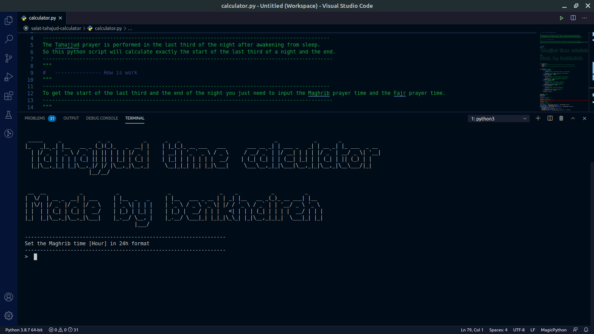
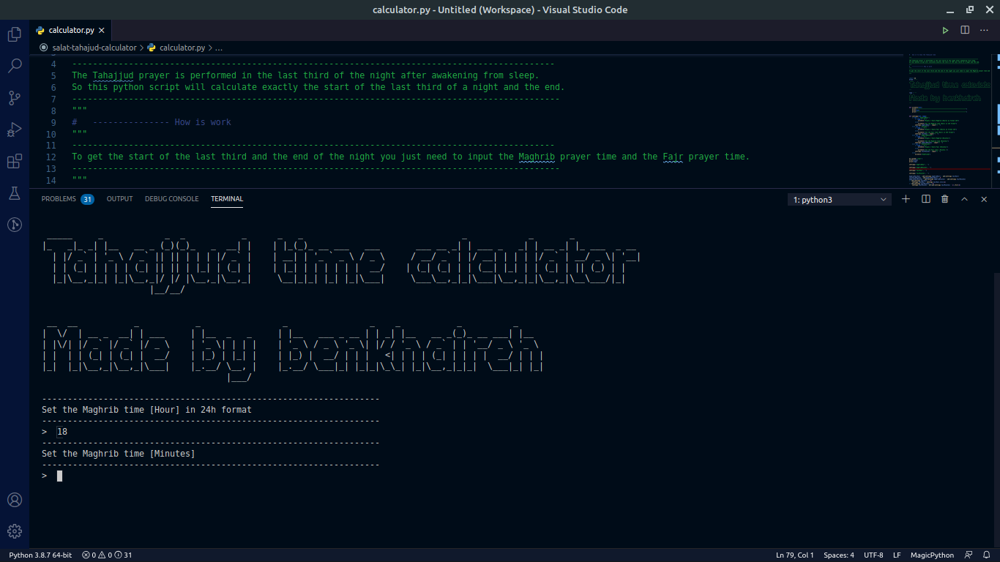
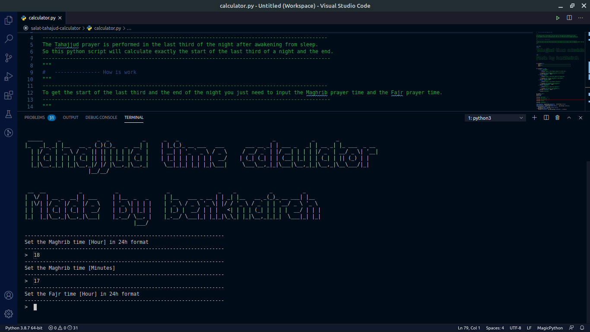
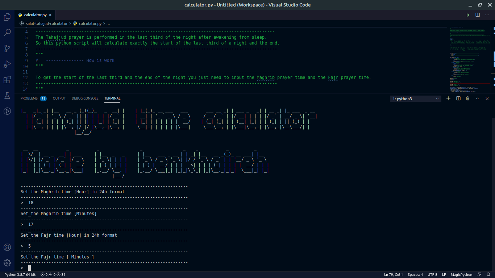
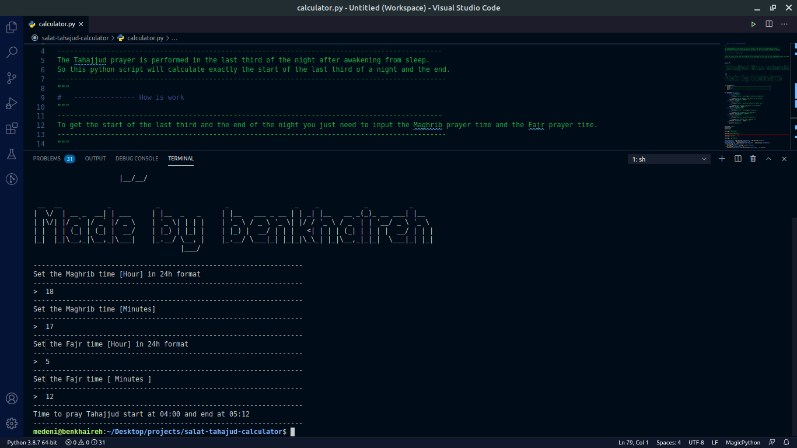

## About tahajjud-calculator

---

> The best time to perform the tahajjud prayer is at the last third of the night. So this python
> script is going to calculate exactly the beginning of the last third of a night and the end.

---

## How is work

---

> To begin, all you have to do is enter the Maghrib prayer period and the Fajr prayer period.

---

> Input Maghrib prayer hour

---

> Input Maghrib prayer minutes

---

> Input Fajr prayer hour

---

> input Fajr prayer minutes

---

> And done tahajjud time output

---
